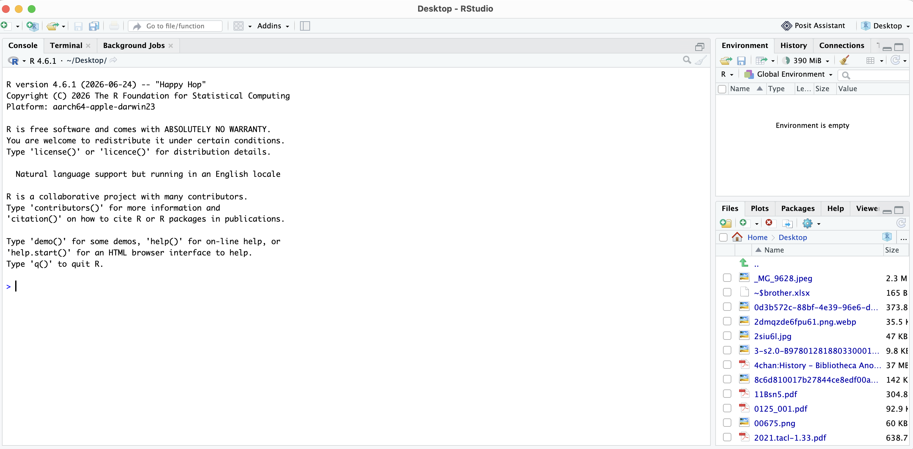
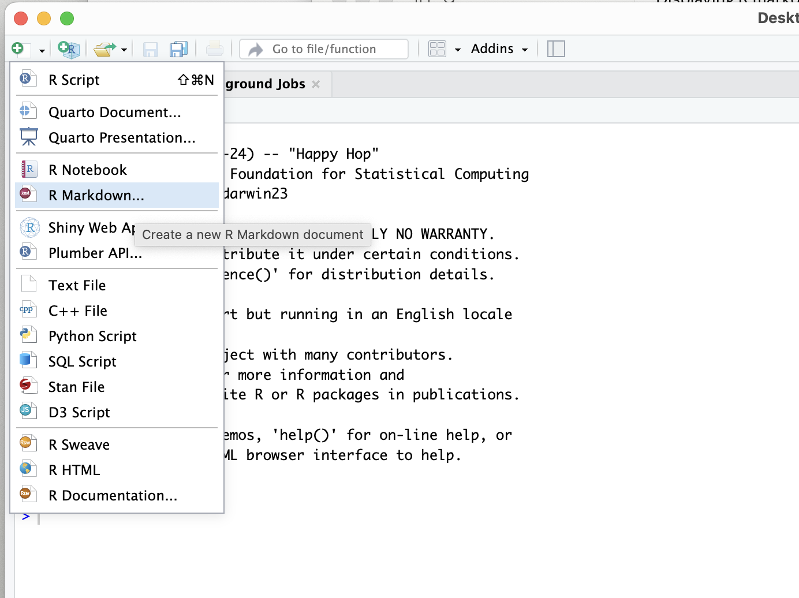
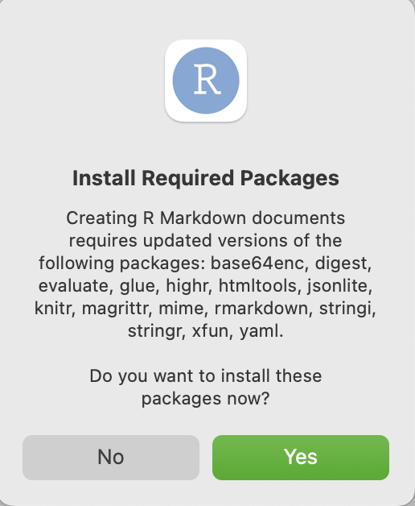
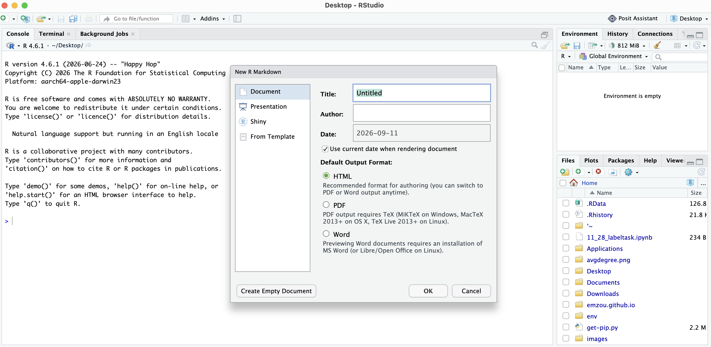
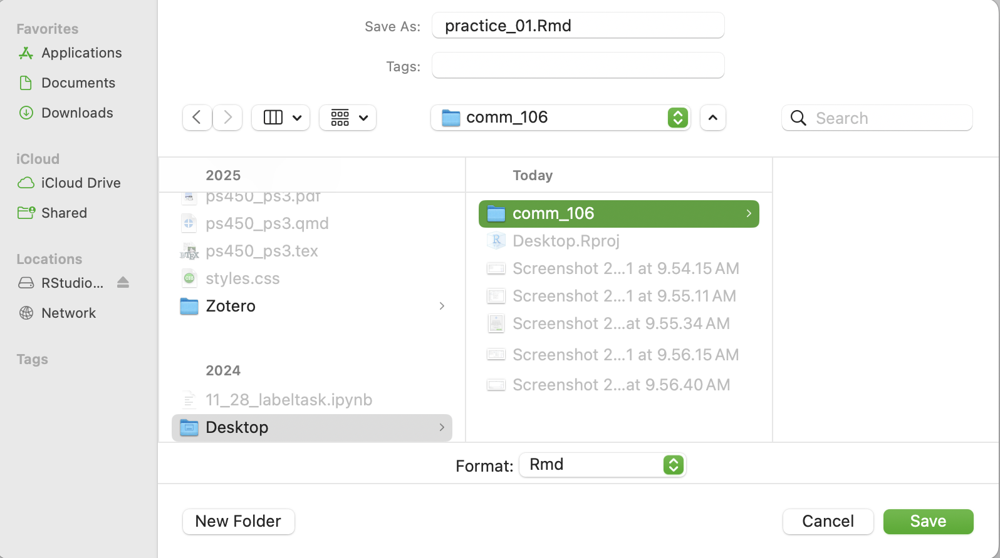
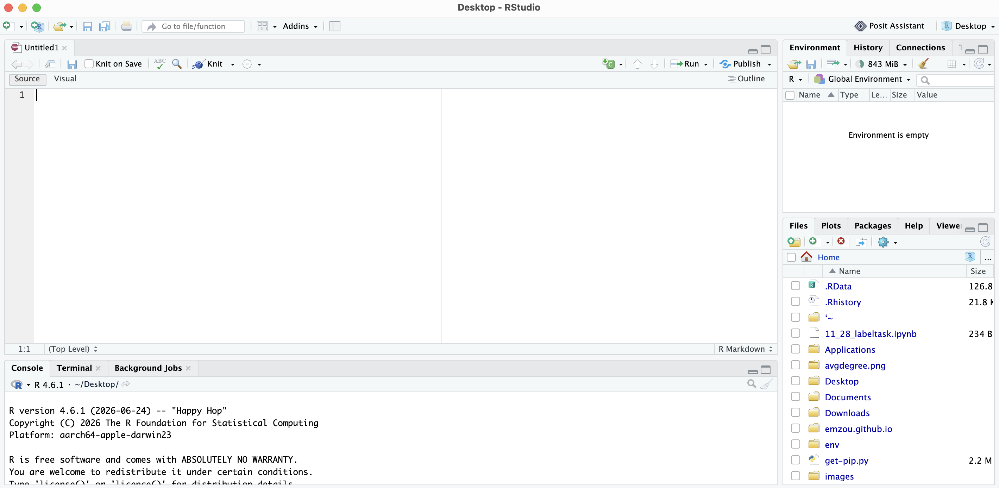

## Create your first R Markdown file 
::: {.screenshot-steps}

1. Open RStudio

    

2. Find the icon to make a new file on the top left, under the toolbar. It looks like a white rectangle with a green plus sign on it. Click on **R Markdown** 

    

3. A pop-up on installing packages will appear, let it run and wait for it to finish.

    

4. Window for making new R Markdown document will appear, click on **Create empty document** 

  

5. Save this file (Command, S on Mac, Ctrl, S on Windows).
 

6.  Name it **practice_01** -- keep the **.Rmd** extension at the end. Save the file in your **comm_106** folder, which lives on your Desktop.

  

:::

In the future, you can find and work on **practice_01.Rmd** in your comm_106 folder. 

