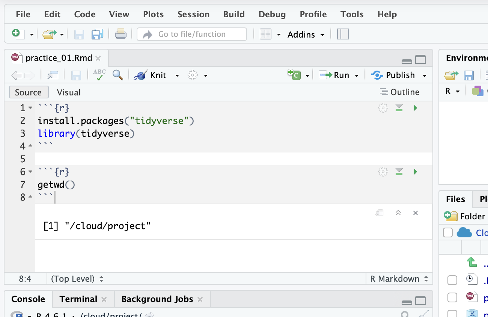

# What does "Working Directory" mean? 
Your working directory is the folder R is currently looking in. When you tell R to  "open titanic.csv," it only looks inside that one folder. If the file is in a different folder (like Downloads), R won't find it, even though the file is on your computer.

We also want to be aware of what working directory we are currently in. 

# Getting working directory

We will use the **getwd()** function. 
getwd() stands for "get working directory." It tells you which folder R is currently "standing in."

1. Create a R code chunk in your markdown file
2. Type getwd(), and run the chunk. 



The output is your current the folder path. 
- For Mac users, the output should look something similar to: `/Users/name/Desktop/comm_106`
- For Windows users, `C:/Users/name/Desktop/comm_106`

::: {.callout-important collapse="true"}
## Windows users: check for OneDrive
If your Desktop is synced to OneDrive, your folder path will look like
`C:/Users/yourname/OneDrive/Desktop/comm_106` instead of
`C:/Users/yourname/Desktop/comm_106`. Run `getwd()` to see which one you have.
:::

- For Posit Cloud users, it should be: "/cloud/project"

# Set working directory

If your working directory isn't your `comm_106` folder, you can change it with the **setwd()** function. setwd() stands for "set working directory." It tells R which folder to look in.

1. Copy the folder path of your `comm_106` folder
2. In the **Console** (bottom left), type `setwd("your folder path")` and hit Enter

For example:

````{.markdown filename="practice_01.qmd"}
```{{r}}
setwd("/Users/name/Desktop/comm_106")
```
````
Run `getwd()` again to double check that it worked.

::: {.callout-tip}
Make sure to use forward slashes (`/`) in your path, not backslashes (`\`). Windows copies paths with backslashes, so you'll need to switch them.
:::

# Load in the dataset 

We'll use the **read_csv** function from the tidyverse package to load our dataset (titanic.csv) in. 

Copy and paste the following in your markdown file, and run the code

````{.markdown filename="practice_01.qmd"}
```{{r}}
df <- read_csv("titanic.csv",  show_col_types = FALSE)
```
````
We'll go over in detail what all of this actually means later, but the gist is that we just turned our csv into something we can actually work with in R. 

If you got an error saying that "titanic.csv does not exist in current working directory," it means that R looked in your working directory and didn't find the file there. Usually this is because the file is saved somewhere else (like your Downloads folder), or because R is looking in a different folder than you think.

Make sure your `titanic.csv` is in your `comm_106` folder. When you run code in a `.rmd` file, R looks in the folder the file is saved in, so keeping your data and your `.rmd` together means R can always find it.

Then run the `read_csv` chunk again.

