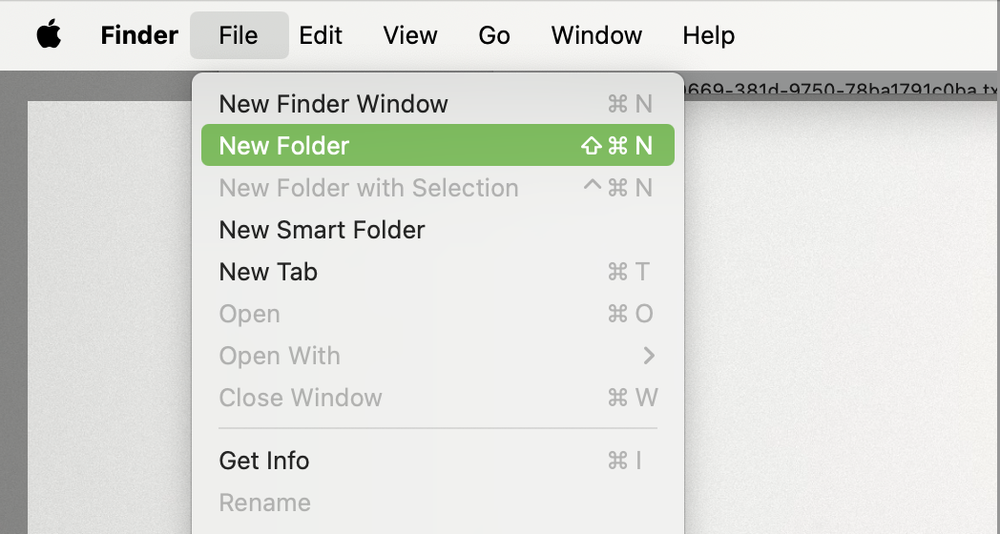
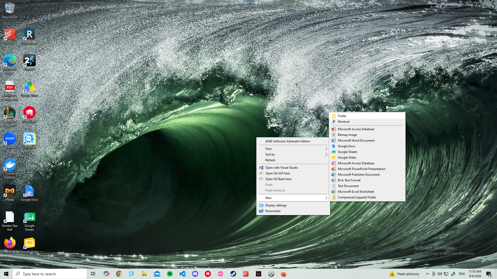
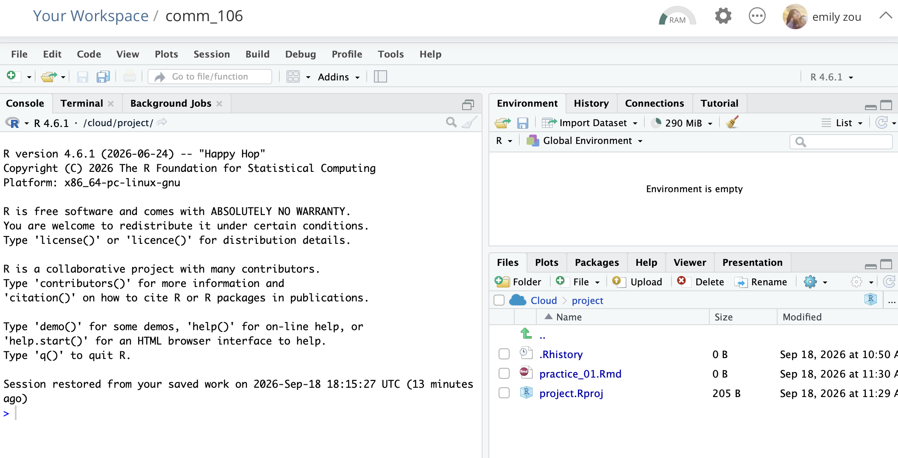

If your machine **is not**  running MacOS, Windows 11 or higher, start from the [Posit Cloud](#posit-cloud) step

# MacOS, Windows 11 or higher
::: {.checklist}
- [ ] Create a folder on your Desktop called `comm_106`
- [ ] Install R
- [ ] Install RStudio 
- [ ] Create R Markdown file
:::

## Create local folder
Create a new folder on your `Desktop` and name it `comm_106`

::: {.os-pair}

:::

## R and RStudio
R and RStudio are different things and need to be installed separately. Once you do this, you won't have to do it again. 

- **R** — the language itself.
- **RStudio** — the app you'll actually look at and type in.

They're separate programs and you need both. `R` alone works but is unpleasant; `RStudio` without `R` won't do anything. 

Unfortunately, the links you'll need to click on to download depend on whether you're using Mac or Windows, and which version of macOS or Windows you're running. 
You can make life easier by updating your macOS/Windows version to the most current version before installing anything.

# Posit Cloud {#posit-cloud}
If you aren't using Mac or Windows, or if you can't update to Windows 11 or above, you can use the free *online* version of RStudio, and don't have to install anything. 

1. Go to the Posit Cloud [site](https://posit.cloud), and click on "Get Started"
2. Select the *Free* plan, and click "Learn more"
3. Sign up for an account -- you can use whatever is most convenient for you
4. Click on `New Project` and select `New RStudio Project`. 
5. Click on `Unnamed project` and rename it to `practice_01`. Your screen should look like this:

6. Go to the [Make R Markdown File](make-rmd) step