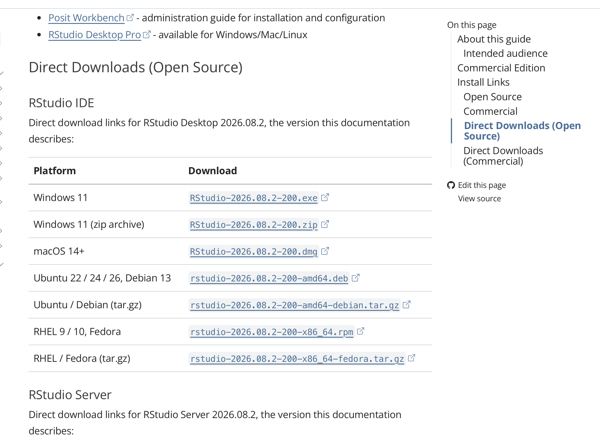
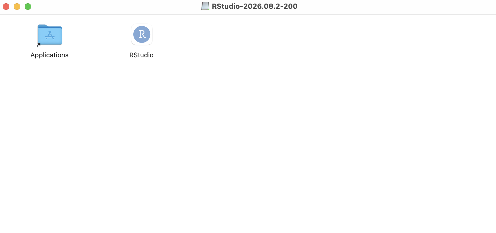
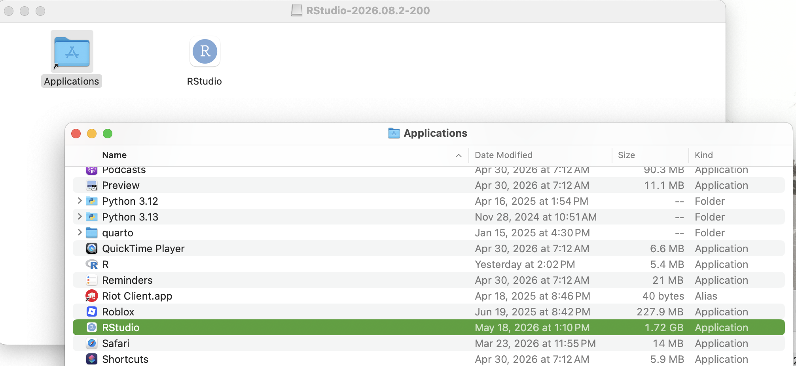
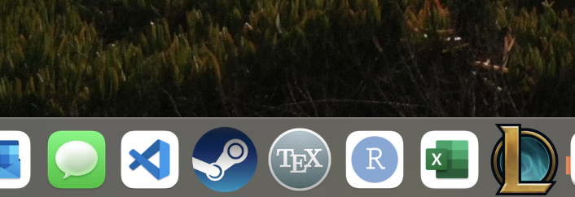

### If you have macOS 14+ 
1. Go to [the RStudio Installation site](https://docs.posit.co/ide/user/#rstudio-ide-oss-downloads)

2. Scroll to `Direct Downloads (Open Source), and look at the first section `RStudio IDE`

3. Click on the `.dmg` file next to macOS 14+ 

### If you have an earlier version of macOS
1. Go to [the RStudio Versions site](https://docs.posit.co/supported-versions/rstudio.html)

2. Click on the Desktop version next to the appropriate macOS version 

## Then, for all cases: 

::: {.screenshot-steps}

1. A window with the `Applications` folder and `RStudio` will appear

    

2. Drag the `RStudio` icon onto the `Applications` folder. Click on the `Applications` folder to open it, and you should see `RStudio` (as well as `R`)

    

3. You can put the `RStudio` icon in your toolbar to find it easily in the future. 

    

:::