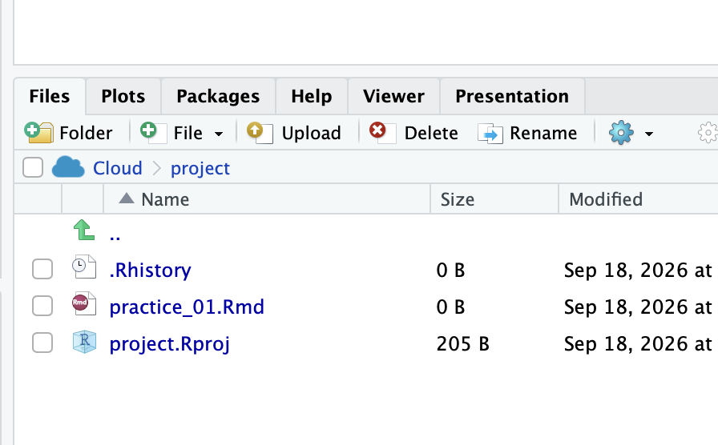
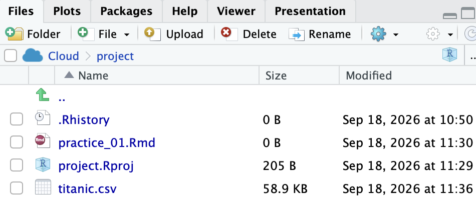

A **CSV** ("comma-separated values") is a plain-text spreadsheet: each line is a row, and commas separate the columns. 
It's one of the most common formats for sharing data. If you open a csv, it will likely automatically open in Apple Numbers or Microsoft Excel. 

# Download data, put in correct folder

1. [Download titanic.csv](titanic.csv){download="titanic.csv"}  
2. Move the download into your comm_106 folder by dragging and dropping the csv into your folder on your desktop. 

## For Posit Cloud users

1. [Download titanic.csv](titanic.csv){download="titanic.csv"} 
2. Go the bottom right panel, and click on `Upload` 


3. Select the `titanic.csv` file. You should see it show up in the bottom right panel: 


---

# Package Installation 
You will need to install *Packages* in R.

When you get a new phone, you can send a picture of your cat to ten of your friends by individually messaging them. Or, you can download Instagram and post the picture of your cat on there. Packages for R are the same concept. If you haven't downloaded Instagram on your phone, your phone doesn't know how to post a picture of your cat on there. 

## tidyverse 
We will be using the tidyverse package. [You can read more about tidyverse [here](https://tidyverse.org)]{.aside}

### Installing Packages

Run install.packages("tidyverse") in a R chunk.

````{.markdown filename="practice_01.qmd"}
```{{r}}
install.packages("tidyverse")
```
````
You only have to do this once. (If you turn off your phone, you don't have to redownload Instagram everytime)

### Loading Packages
In order to actually use the package, you need to load it with every session with the **library()** function
````{.markdown filename="practice_01.qmd"}
```{{r}}
library(tidyverse)
# Note that there are no quotation marks around tidyverse
```
````


