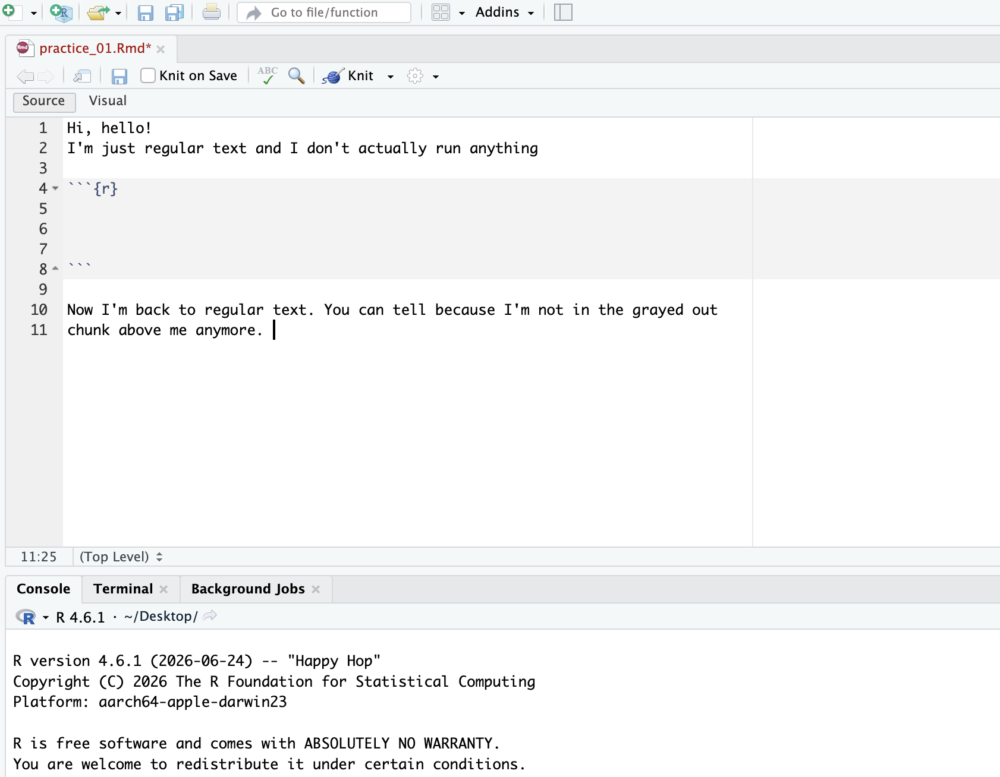

[We can directly switch between two languages -- human and R -- on Rmd files]{.lead}



- Type anything into your .Rmd file. 
  - This will show up when your run the whole Rmd file, but it's not actually code.We can write notes on what our code is about, or describe the results of some code.  

- Now, type: `` ```{r} ``

  - A grayed-out rectangle will appear. We're telling the computer that we want to 
  talk to it in R now. 

- Press enter a few times, and the rectangle will expand. 

- We close this chunk by putting  `` ``` ``

- Outside of this chunk, we're back to human language again. 

````{.markdown filename="practice_01.Rmd"}
In this section, we will demonstrate how one can write in both the human and R language by simply. I can enter R mode by: 
```{{r}}


```
We can make chunks of code in this way.
````